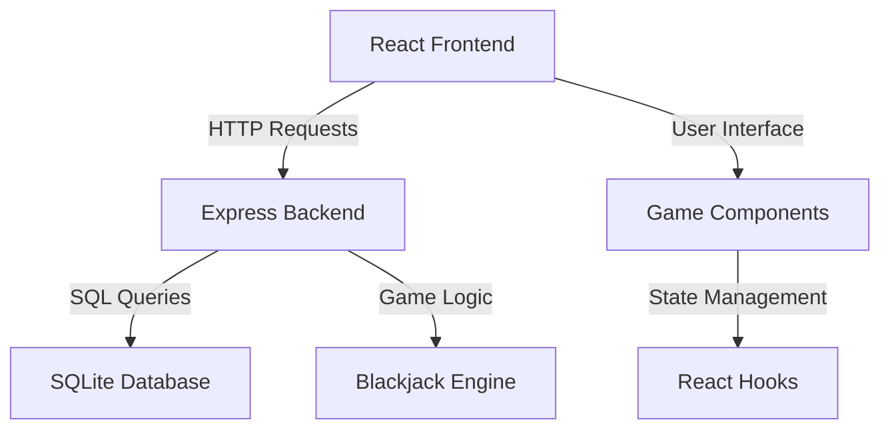

# Blackjack Game Implementation Specification

## Project Overview

A single-player Blackjack game with a React frontend and Node.js backend, featuring user profiles, game history tracking, and a clean REST API architecture.

## Technology Stack

### Backend
- **Runtime**: Node.js
- **Build Tool**: Vite (for development tooling)
- **Framework**: Express.js
- **Database**: SQLite with Sequelize ORM
- **Language**: JavaScript (ES6+)

### Frontend
- **Framework**: React 18+
- **Build Tool**: Vite
- **Styling**: CSS Modules or Styled Components
- **HTTP Client**: Axios
- **Language**: JavaScript (ES6+)

## System Architecture



## Project Structure

```
blackjack/
├── backend/
│   ├── src/
│   │   ├── controllers/
│   │   ├── models/
│   │   ├── routes/
│   │   ├── services/
│   │   ├── middleware/
│   │   └── utils/
│   ├── package.json
│   ├── vite.config.js
│   └── server.js
├── frontend/
│   ├── src/
│   │   ├── components/
│   │   ├── hooks/
│   │   ├── services/
│   │   ├── styles/
│   │   └── utils/
│   ├── public/
│   ├── package.json
│   └── vite.config.js
├── README.md
└── package.json (root)
```

## Game Rules & Features

### Basic Blackjack Rules
- Standard 52-card deck
- Card values: 2-10 (face value), J/Q/K (10), A (1 or 11)
- Goal: Get as close to 21 without going over
- Dealer must hit on 16 and below, stand on 17 and above
- Player wins if: closer to 21 than dealer, dealer busts, player gets blackjack
- Player loses if: busts (over 21), dealer closer to 21

### Game Features
- **New Game**: Start fresh round
- **Hit**: Take another card
- **Stand**: Keep current hand
- **Game Over Detection**: Automatic win/loss/tie determination
- **Score Tracking**: Wins, losses, ties per user
- **Game History**: Complete record of all games played

## Database Schema

### Users Table
```sql
CREATE TABLE users (
    id INTEGER PRIMARY KEY AUTOINCREMENT,
    username VARCHAR(50) UNIQUE NOT NULL,
    email VARCHAR(100) UNIQUE NOT NULL,
    password_hash VARCHAR(255) NOT NULL,
    created_at DATETIME DEFAULT CURRENT_TIMESTAMP,
    updated_at DATETIME DEFAULT CURRENT_TIMESTAMP
);
```

### Games Table
```sql
CREATE TABLE games (
    id INTEGER PRIMARY KEY AUTOINCREMENT,
    user_id INTEGER NOT NULL,
    player_hand JSON NOT NULL,
    dealer_hand JSON NOT NULL,
    player_score INTEGER NOT NULL,
    dealer_score INTEGER NOT NULL,
    result ENUM('win', 'loss', 'tie') NOT NULL,
    created_at DATETIME DEFAULT CURRENT_TIMESTAMP,
    FOREIGN KEY (user_id) REFERENCES users(id)
);
```

### User Stats Table
```sql
CREATE TABLE user_stats (
    id INTEGER PRIMARY KEY AUTOINCREMENT,
    user_id INTEGER UNIQUE NOT NULL,
    total_games INTEGER DEFAULT 0,
    wins INTEGER DEFAULT 0,
    losses INTEGER DEFAULT 0,
    ties INTEGER DEFAULT 0,
    win_percentage DECIMAL(5,2) DEFAULT 0.00,
    updated_at DATETIME DEFAULT CURRENT_TIMESTAMP,
    FOREIGN KEY (user_id) REFERENCES users(id)
);
```

## REST API Specification

### Authentication Endpoints
- `POST /api/auth/register` - Create new user account
- `POST /api/auth/login` - User login
- `POST /api/auth/logout` - User logout
- `GET /api/auth/profile` - Get current user profile

### Game Endpoints
- `POST /api/game/new` - Start new game
- `POST /api/game/:gameId/hit` - Player takes a card
- `POST /api/game/:gameId/stand` - Player stands
- `GET /api/game/:gameId` - Get current game state
- `GET /api/game/history` - Get user's game history

### User Stats Endpoints
- `GET /api/stats/user/:userId` - Get user statistics
- `GET /api/stats/leaderboard` - Get top players (optional)

## Frontend Component Structure

### Main Components
- `App.js` - Root component with routing
- `GameBoard.js` - Main game interface
- `PlayerHand.js` - Display player's cards
- `DealerHand.js` - Display dealer's cards
- `GameControls.js` - Hit/Stand buttons
- `GameStats.js` - Display current game stats
- `UserProfile.js` - User account management
- `GameHistory.js` - Historical games list
- `Login.js` - Authentication form
- `Register.js` - User registration form

### Utility Components
- `Card.js` - Individual card display
- `Deck.js` - Card deck visualization
- `ScoreDisplay.js` - Show hand values
- `GameResult.js` - Win/loss/tie notification

## Backend Service Architecture

### Controllers
- `AuthController.js` - Handle authentication
- `GameController.js` - Manage game logic
- `UserController.js` - User management
- `StatsController.js` - Statistics handling

### Services
- `BlackjackService.js` - Core game logic
- `DeckService.js` - Card deck management
- `UserService.js` - User operations
- `GameService.js` - Game state management

### Models
- `User.js` - User data model
- `Game.js` - Game data model
- `UserStats.js` - Statistics model

## Game Logic Specifications

### Card Representation
```javascript
{
  suit: 'hearts' | 'diamonds' | 'clubs' | 'spades',
  rank: 'A' | '2' | '3' | '4' | '5' | '6' | '7' | '8' | '9' | '10' | 'J' | 'Q' | 'K',
  value: number // 1-11 for Ace, 10 for face cards, face value for others
}
```

### Game State Structure
```javascript
{
  gameId: string,
  userId: number,
  playerHand: Card[],
  dealerHand: Card[],
  playerScore: number,
  dealerScore: number,
  gameStatus: 'active' | 'player_bust' | 'dealer_bust' | 'player_win' | 'dealer_win' | 'tie',
  isPlayerTurn: boolean,
  isGameOver: boolean
}
```

### Score Calculation Rules
- Ace handling: Start as 11, convert to 1 if hand would bust
- Soft/Hard hand detection
- Blackjack detection (21 with 2 cards)
- Bust detection (over 21)

## Development Setup

### Backend Setup
1. Navigate to `backend/` directory
2. Run `npm install`
3. Set up environment variables
4. Initialize database with `npm run db:migrate`
5. Start development server with `npm run dev`

### Frontend Setup
1. Navigate to `frontend/` directory
2. Run `npm install`
3. Configure API endpoint in environment
4. Start development server with `npm run dev`

## API Response Formats

### Success Response
```javascript
{
  success: true,
  data: {
    // Response data
  },
  message: "Operation successful"
}
```

### Error Response
```javascript
{
  success: false,
  error: {
    code: "ERROR_CODE",
    message: "Human readable error message"
  }
}
```

## Security Considerations

- Password hashing with bcrypt
- JWT tokens for session management
- Input validation and sanitization
- CORS configuration
- Rate limiting on API endpoints
- SQL injection prevention with ORM

## Testing Strategy

### Backend Testing
- Unit tests for game logic
- Integration tests for API endpoints
- Database operation tests

### Frontend Testing
- Component unit tests with React Testing Library
- User interaction tests
- API integration tests

## Deployment Considerations

- Environment configuration management
- Database migration scripts
- Build optimization for production
- Static asset serving
- Error logging and monitoring

## Future Enhancements

- Multiple deck support
- Betting system
- Split and double down features
- Multiplayer support
- Real-time notifications
- Mobile responsive design
- Progressive Web App features